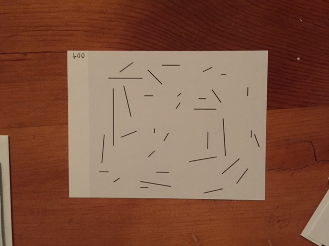

This post is a response to my mail art network, and how I thought it went. All in all, it was a successful project. I went back to check the songs to see how many people had submitted, and there were a good number of posts. What I did find interesting was that there was a wide spread between pieces. By this I mean some only had one or two songs and others had 10. I send equal amounts of postcards between each piece, so some people just didn't response.

When I think about why people may not have responded, I think a lot of things. First of all, I think it may have been a bit difficult for people to navigate to my site. Since it involved typing a url into the browser, some people may have given up easily. It is difficult to convince people to take the time to invest into your project. Perhaps this is one reason why it didn't work as well as I hoped.

The other reason is that I do not think the network performed as nicely as I wanted it to. I invited the people I sent the postcards to to forward the postcard on to a friend - this way a network would be created and more and more songs would be added. Two things to note here - once someone stops sending the postcard, that postcard freezes. More are not generated. Thus, once enough people stop sending theirs it will stop as a whole. Secondly, there was no postage for people to send the letter to a friend. They would have to add more, which is a cost they may not have wanted to incur.

All in all I enjoyed the project.

-m
